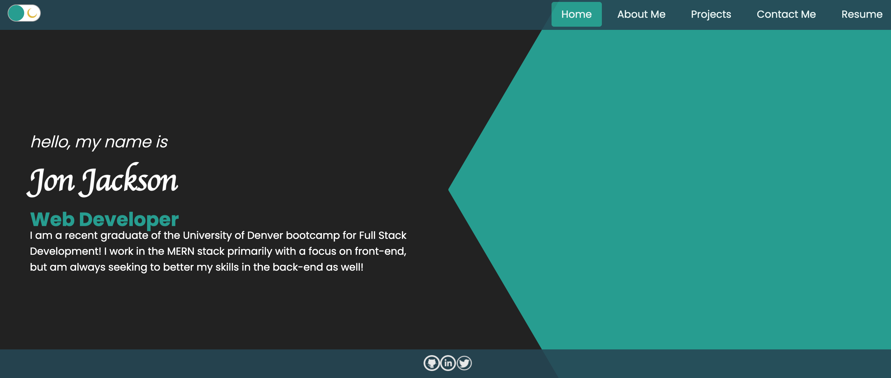
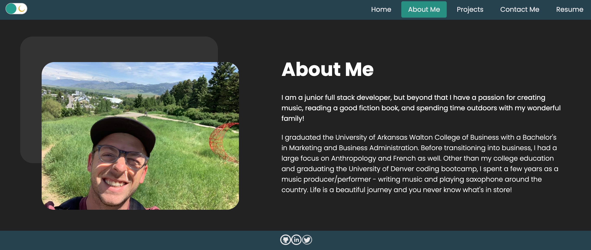
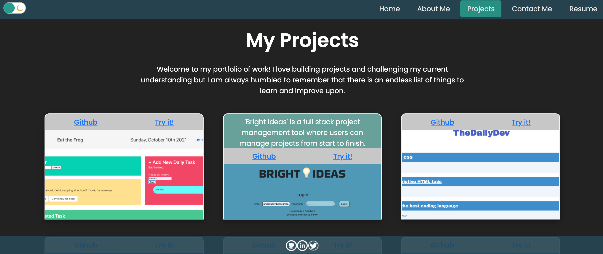
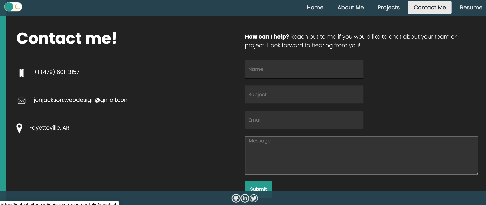
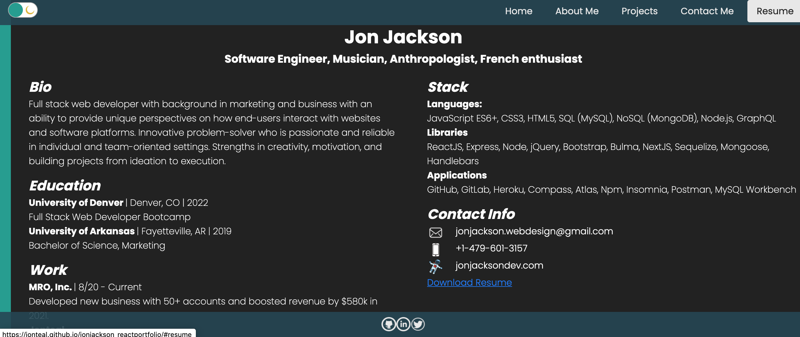

# Jon Jackson - Portfolio

## Description
My latest rendition of my portfolio of projects was to create one entirely using ReactJS. Included are sections containing a short bio about me, a page displaying 6 of my most recent projects, a contact form for people to get a hold of me, and also a page displaying a resume with a downloadable version. There are also links to my Github, LinkedIn, and Twitter accounts. And as a bonus feature, there is a dark mode toggle switch! 

## User Story

```
AS AN employer
I WANT to view a potential employee's deployed portfolio of work samples
SO THAT I can review samples of their work and assess whether they're a good candidate for an open position
```

## Acceptance Criteria

```
GIVEN I need to sample a potential employee's previous work
WHEN I load their portfolio
THEN I am presented with the developer's name, a recent photo or avatar, and links to sections about them, their work, and how to contact them
WHEN I click one of the links in the navigation
THEN the UI scrolls to the corresponding section
WHEN I click on the link to the section about their work
THEN the UI scrolls to a section with titled images of the developer's applications
WHEN I am presented with the developer's first application
THEN that application's image should be larger in size than the others
WHEN I click on the images of the applications
THEN I am taken to that deployed application
WHEN I resize the page or view the site on various screens and devices
THEN I am presented with a responsive layout that adapts to my viewport
```

## Links

Github: https://github.com/jonteal/jonjackson_reactportfolio

View my portfolio here: https://jonteal.github.io/jonjackson_reactportfolio/

## Screenshots

#### Homepage


#### About Me


#### Projects


#### Contact Me


#### Resume


## Collaborators

Jon Jackson: jonjackson.webdesign@gmail.com

# License
* MIT